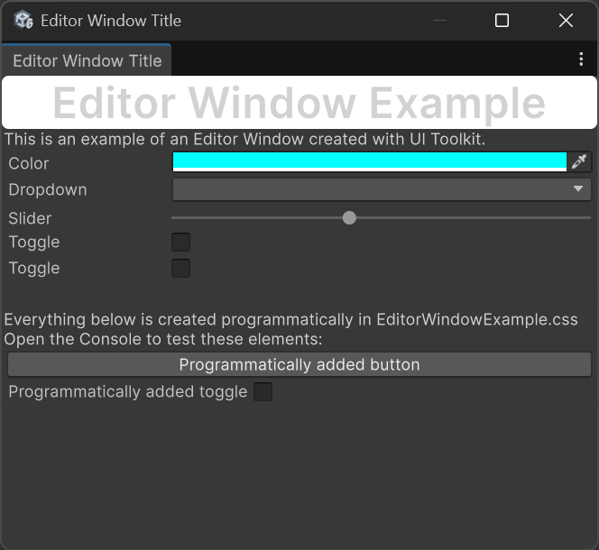
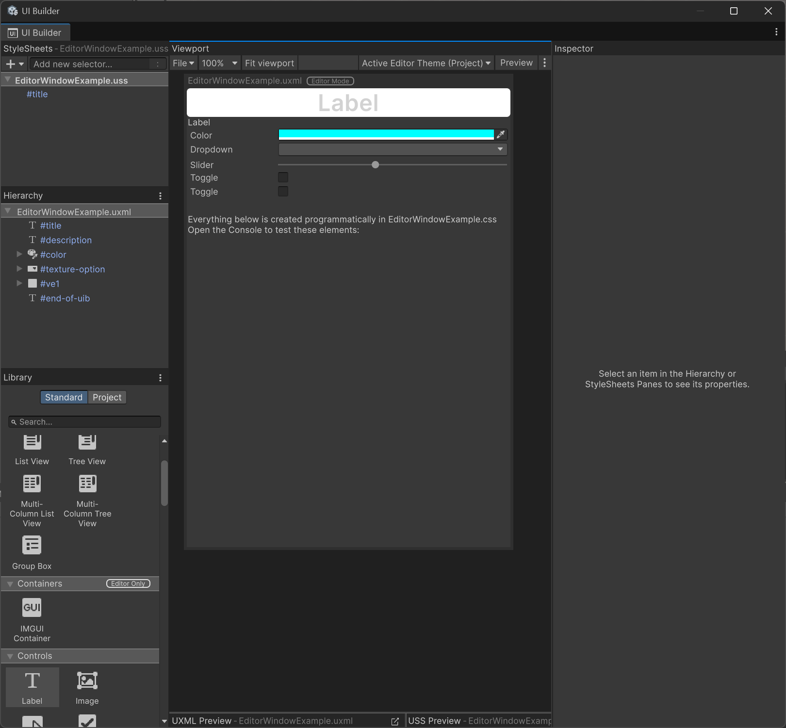
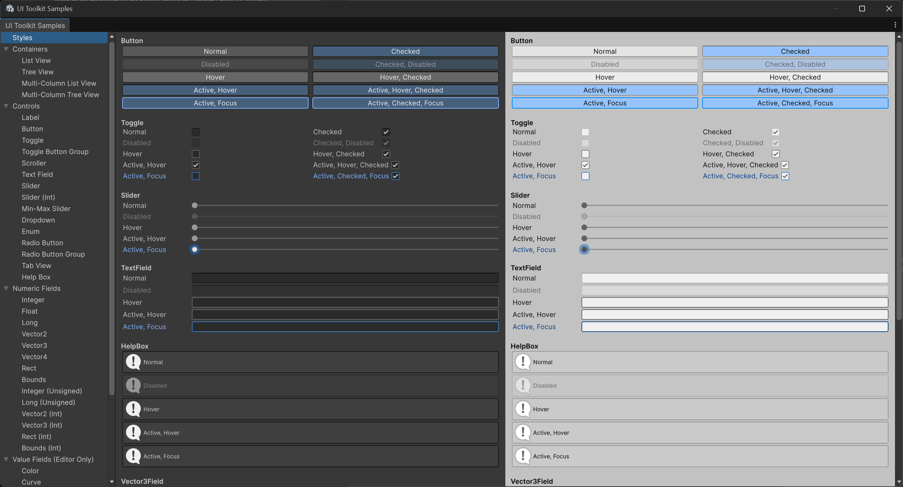

# EditorWindowExample

1. Copy this folder to ``Assets/EditorWindowExample`` 
2. In the Unity Editor Menu go to ``Tools > Editor Window Example``. This will open the custom window:    

3. The first half of the window was created using the UI Builder tool. To see how, either open ``Window > UI Toolkit > UI Builder`` or double click on ``EditorWindowExample.uss`` from the Project Tab:  

4. In the left pane, you can modify existing UI elements or drop new ones.
5. Note that the final two buttons from the window are not visible in the UI Builder. This is because they're declared in ``EditorWindowExample.cs`` to showcase that UI elements can also be added using only C# instead of the UI builder. The file also includes the callbacks for the UI elements.
6. To see a list of possible UI elements with minimal examples, open ``Window > UI Toolkit > UI Builder``:   
