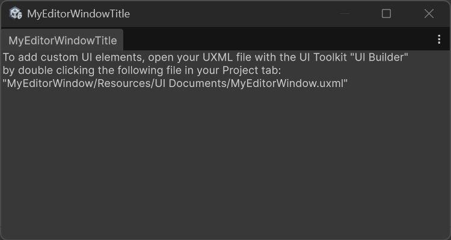

# MyEditorWindow

1. Copy this folder to ``Assets/MyEditorWindow`` 
2. In the Unity Editor Menu go to ``Tools > My Editor Window``. This will open the custom window:    

3. The window was designed using the UI Builder tool. To see how, either open ``Window > UI Toolkit > UI Builder`` or double click on ``MyEditorWindow.uss`` from the Project Tab.
4. In the left pane, you can modify existing UI elements or drop new ones.
5. Inspect ``MyEditorWindow.cs`` to see how the window is implemented.
6. Move on to [EditorWindowExample](../EditorWindowExample/README.md) for a slightly more interesting example.