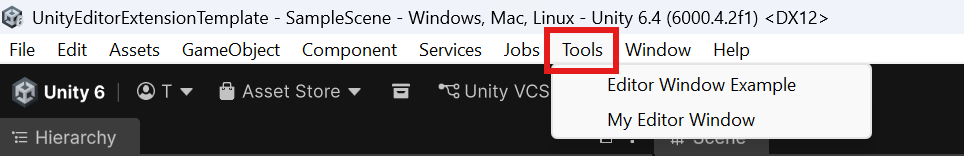

# Unity Editor Extension Templates 

This repo provides simple templates for anyone who wants to start developing custom UI and extensions for the Unity Editor using the integrated UI Toolkit and the UI Builder.

## 🗂️ Contents

| Template Name | Description |
| ------------- | ------------- |
|  [MyEditorWindow](./MyEditorWindow/README.md)  | Minimal template for creating a custom UI Window.  |
|  [EditorWindowExample](./EditorWindowExample/README.md)   | Example template showing basic UI elements and callbacks. Mixture of UI elements created in C# and with UI Builder. |

## ✅ Getting Started

If you found this repo trying to figure out how to extend the UI and just need a quick tutorial to get started, do the following examples in this order to get a basic grasp of the concepts (15-20 Minutes):
1. [MyEditorWindow](./MyEditorWindow/README.md)
2. [EditorWindowExample](./EditorWindowExample/README.md)
3. Go to [Further Reading](#-further-reading)

To use a template, copy the folder (e.g. ``MyEditorWindow``) into the ``Assets/`` folder of your Project.
It can then be opened from Unity's menu bar via ``Tools/[Template Name]``:

## 📖 Further reading

- Create a custom Editor window using C#: 
https://docs.unity3d.com/6000.4/Documentation/ScriptReference/EditorWindow.html

- ``EditorTool`` documentation: 
https://docs.unity3d.com/ScriptReference/EditorTools.EditorTool.html
